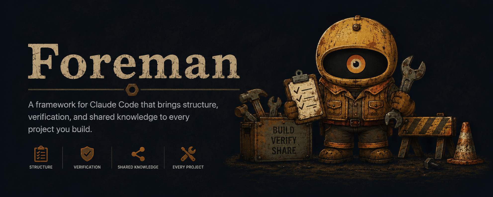

<div align="center">
  
</div>

# Foreman AI

A local AI-assisted development control plane built around deterministic execution.

---

## What is it?

Foreman AI is a framework that runs on top of Claude Code. It adds structure to every session: a spec interview before any work begins, a verification step before any output ships, and a native CLI (`foreman-tools`) that replaces Claude's inline shell reasoning with 70 structured JSON subcommands — so every session starts fast, stays on track, and spends tokens on reasoning instead of parsing.

---

## Who is it for?

Engineers, technical teams, and agencies running real projects with Claude Code. Claude is a skilled worker — but without structure it builds the wrong thing confidently, skips verification, and forgets what was decided last session. Foreman puts a foreman on the job: specs before work, verification before shipping, and a knowledgebase that carries context across every session.

---

## Why does it exist?

AI-assisted development without determinism is expensive guesswork. Every token Claude spends parsing git output or re-deriving project state is waste. Foreman eliminates that waste: a session that starts slower or burns more tokens than without it is a failure.

---

## Features

- **Spec-first workflow** — `/new-project` interviews you, writes a scope, requires sign-off before any code is written
- **Built-in verification** — `/verify-output` runs a self-review then an independent Claude critic agent before anything ships
- **Native CLI** — `foreman-tools` replaces shell parsing with 70 structured JSON subcommands
- **TUI dashboard** — interactive split-panel project overview
- **Worker system** — language workers (Python, Node, Go, Swift, Zig, and more) for tasks that need a runtime
- **Plugin ecosystem** — public and private plugins via `/setup`, share as a zip
- **Portable knowledge** — pinned knowledge backs up to your private GitHub, restores on any machine in three commands
- **Token discipline** — every framework line earns its place; no commentary, no placeholders, no duplication

---

## Philosophy

- AI assists. It does not replace engineering judgment.
- Local execution first. Nothing phones home.
- Deterministic tooling — Zig, not shell scripts.
- Human remains in control. Every release requires a diff review.

---

## Installation

```bash
brew tap michaelvgonzaga/foreman
brew trust michaelvgonzaga/foreman
brew install foreman-ai
```

Then from any directory:

```bash
foreman-ai
```

On first run it walks you through setup and opens your Foreman workspace in Claude Code.

**Update:**
```bash
brew upgrade foreman-ai
```

**Uninstall:**
```bash
brew uninstall foreman-ai && brew untap michaelvgonzaga/foreman
```

**Manual install:**
```bash
git clone https://github.com/michaelvgonzaga/foreman.git
claude /path/to/foreman
```

---

## Quick Start

Inside Claude Code:

1. Run `/first-run` — one-time setup: dependency checks, GitHub auth, mode selection (Power User or Guest), pinned knowledge restore. Takes ~2 minutes.
2. Run `/new-project` — spec interview → scoped build → verify → ship.

---

## How it works

```mermaid
flowchart TD
    A([Session Start]) --> B[compat-check\nZig binary, zero tokens]
    B -->|drift| C[Surface rollback advice]
    B -->|ok| D[doctor\nverify claude · git · gh]
    D --> E{Cache warm?}
    E -->|hit| F[Load ROADMAP state\nfrom cache]
    E -->|miss| G[Read ROADMAP.md\ncache-store result]
    G --> F

    F --> H{Starting\nfresh or continuing?}

    H -->|New project| I[/new-project\nSpec interview · sign-off]
    H -->|Continue| J[Resume from\nROADMAP active work]

    I --> K[Build]
    J --> K

    K --> L[/verify-output\nSelf-review + critic agent]
    L -->|Pass| M[Ship]
    L -->|Fail| N[Fix]
    N --> L

    M --> O[/release or /brew-release]

    subgraph FT[foreman-tools — 70 subcommands]
        P[git · gh state]
        Q[build · test]
        R[cache · outline]
        S[release · export]
        T[ledger · ledger score]
    end

    K -. structured JSON .-> FT
    L -. structured JSON .-> FT
    O -. structured JSON .-> FT
```

**Session startup is under 200ms.** All git state, tool versions, and project context come from `foreman-tools` as pre-computed JSON — no Claude tokens spent parsing shell output.

---

## Token savings

Every cache hit, git query, and build-result read that goes through `foreman-tools` instead of Claude's inline reasoning saves tokens. Check your running total anytime:

```bash
foreman-tools metrics
```

```json
{
  "cacheEntries": 10,
  "estimatedTokenSavings": 1600,
  "note": "savings estimated at 80% hit rate x 200 tokens/hit"
}
```

Savings compound as the cache warms across sessions and more subcommands cover more of your workflow.

---

## Roadmap

- [x] CLI — `foreman-tools` with 70 structured subcommands
- [x] TUI — interactive project dashboard
- [x] Worker ecosystem — Python, Node, Go, Swift, Zig, and more
- [x] Plugin SDK — public and private plugin support
- [x] Portable knowledge — GitHub-backed pinned knowledge, restores on any machine
- [x] Export / Import — `.fmz` format for project portability and workspace backup
- [ ] Plugin marketplace
- [ ] Team workspace sync
- [ ] Windows support

---

Built with [Claude Code](https://claude.ai/code).
